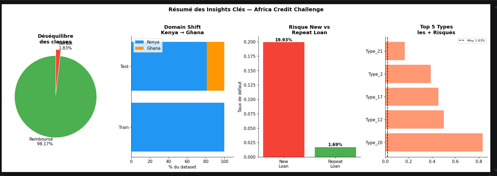
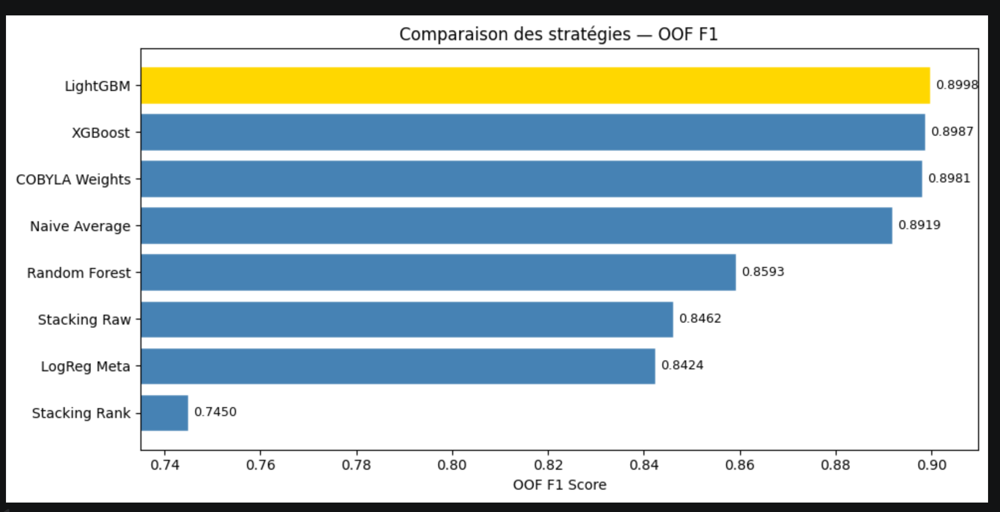

# 🌍 AI4EAC Finance Practice Challenge
### May Study Jam Series | Zindi Africa

[](https://zindi.africa)
[](https://zindi.africa)
[](https://zindi.africa)
[](https://python.org)
[](https://lightgbm.readthedocs.io)
[](https://fastapi.tiangolo.com)
[](https://docker.com)
[](https://cloud.google.com/run)
[](https://huggingface.co/spaces/kgueye001/africa-credit-scoring)

---

## 🔗 Live Demo

| Service | URL |
|---------|-----|
| 🎮 Interface Gradio | [huggingface.co/spaces/kgueye001/africa-credit-scoring](https://huggingface.co/spaces/kgueye001/africa-credit-scoring) |
| ⚡ API REST | [africa-credit-api-245513771842.europe-west1.run.app/docs](https://africa-credit-api-245513771842.europe-west1.run.app/docs) |

---

## 🎯 Challenge Overview

**Objective:** Predict whether a loan will be repaid or default (binary classification)

**Key challenge:** Train on Kenya data only → Predict on Kenya **and Ghana** (domain shift)

**Metric:** F1 Score (micro)

**Results:**

| Metric | Score |
|--------|-------|
| 🏆 Best Public F1 | **0.6805** |
| 📊 Best OOF F1 | **0.8968** |
| 🥇 Leaderboard Rank | **17th / 151** |
| 📈 Improvement | +0.049 (0.6318 → 0.6805) |

---

## 📊 Key Insights



> **Left to right:** Class imbalance (98%/2%),
> Domain shift Kenya→Ghana, New vs Repeat loan risk,
> Top 5 riskiest loan types

---

## 📂 Dataset Structure

```
Train.csv  : 68,654 rows | Kenya only | 1.83% default rate
Test.csv   : 18,594 rows | Kenya (81%) + Ghana (19%)
```

**Hierarchical structure:**
```
1 CLIENT
└── multiple LOANS
    └── multiple ROWS (1 per lender)
        → Same target on all rows of the same loan
```

This creates a fundamental modeling question:
**predict at line level, loan level, or client level?**

---

## 🚀 Solution Overview

### Core Insight — Multi-Granularity Stacking

Rather than choosing between line-level and loan-level prediction,
we trained both and combined them:

```
Model 1 (Line Level)  → captures lender-specific patterns
Model 2 (Loan Level)  → captures loan-level aggregated patterns
Final Prediction      → 50% Model 1 + 50% Model 2
```

This stacking improved our score from **0.6648 → 0.6805 (+0.016)**

---

## ⚙️ Feature Engineering

The biggest gain in the project: **16 raw columns → 53+ features (+0.033 F1)**

### Financial Ratios
```python
interest_pct   = interest_amount / total_amount      # cost of loan
repay_ratio    = total_to_repay / total_amount        # repayment burden
daily_interest = interest_amount / duration           # daily cost
lender_vs_total= amount_funded / total_amount         # lender exposure
```

### Temporal Features
```python
disb_month, disb_day, disb_dayofweek
disb_is_weekend, disb_quarter, disb_week
actual_duration = due_date - disbursement_date
```

### Client Aggregations
```python
# Computed on TRAIN only → applied to TEST
# (Ghana unknown clients → Kenya median as fallback)
cust_n_loans, cust_avg_amount, cust_avg_interest
lender_n_loans, lender_avg_funded
loan_n_lenders, loan_total_funded
```

### Macroeconomic Data (FRED)
```python
# Added manually for 2024 (FRED data ends in 2023)
inflation, exchange_rate, unemployment
deposit_rate, lending_rate, rate_spread
```

---

## 🤖 Modeling

### LightGBM — Core Parameters
```python
lgb_params = {
    'n_estimators'     : 2000,
    'learning_rate'    : 0.03,
    'num_leaves'       : 63,
    'is_unbalance'     : True,   # handles 98%/2% imbalance
    'feature_fraction' : 0.7,
    'bagging_fraction' : 0.7,
    'reg_lambda'       : 1.0,
}
```

### Validation Strategy
```
StratifiedKFold (n=5)
→ Ensures each fold maintains 1.83% default rate
→ OOF predictions for honest evaluation
→ Threshold optimized on OOF (0.715, not default 0.5)
```

## 🤖 Model Comparison



> LightGBM dominates with OOF F1 = 0.8998,
> followed by XGBoost (0.8987).
> Single models outperform naive ensembles
> on this dataset.

---

## 📊 Experiments & Results

| Version | Innovation | Public F1 | Delta |
|---------|-----------|-----------|-------|
| V1 | LightGBM baseline | 0.6318 | — |
| V2 | Fix aggregation leakage | 0.6430 | +0.011 |
| V3 | Target encoding | 0.2710 | -0.372 ❌ |
| V4 | 3 models + ensembles | 0.6628 | +0.020 |
| V5 | Pseudo-labeling | 0.6149 | — ❌ |
| V8 | FRED 2024 data | **0.6648** | +0.002 |
| V16 | Multi-granularity stacking | **0.6805** | +0.016 🥇 |

---

## 🚨 Key Learnings

### 1. The Domain Shift Problem
```
Train (Kenya)  → OOF F1 = 0.8968
Test (Kenya+Ghana) → Public F1 = 0.6805
Gap = 0.216  ← entirely due to Ghana

Same feature, different meaning:
  interest_pct = 0.15 → "low rate"  in Kenya
  interest_pct = 0.15 → "high rate" in Ghana
```

### 2. The Golden Rule of Aggregations
```
✅ Compute on TRAIN → Apply on TEST
❌ Never recompute on TEST
❌ Never use TARGET to create features (leakage!)

V3 violation: target encoding → Public 0.27 (catastrophic drop)
```

### 3. Feature Engineering > Stacking
```
Feature engineering alone: +0.033
Stacking alone:             +0.016
→ Build good features FIRST, then stack
```

### 4. OOF ≠ Public Score
```
Optimizing CV (Kenya) does not always
improve Public LB (Kenya + Ghana)

Examples where higher OOF → lower Public:
  V7 slow_lr   : OOF 0.8976 → Public 0.6426
  V10 norm     : OOF 0.8964 → Public 0.6510
```

---

## 🛑 What Didn't Work

| Approach | Why it Failed |
|----------|--------------|
| Target Encoding | Leakage: 0.8943 OOF → 0.2710 Public |
| Pseudo-Labeling | Ghana predictions too noisy to reuse |
| CatBoost | Poor on 1.83% imbalance, early stopping at iter ~100 |
| Hyperparameter Tuning | Overfitting Kenya, worse on Ghana |
| Country Normalization | Normalizing Ghana with Kenya stats = noise |
| GroupKFold | 94% data in 2022 → unbalanced groups |
| Train+Test Combined | Kenya stats contaminated by Ghana |

---

## 🚀 Production Deployment

Full end-to-end ML pipeline deployed in production:

```
Kaggle Notebook
      ↓
  model.py (LightGBM × 5 folds)
      ↓
  app.py (FastAPI REST API)
      ↓
  Dockerfile (python:3.10-slim + libgomp1)
      ↓
  Google Container Registry
      ↓
  Google Cloud Run (europe-west1, 4Gi RAM, 2 CPU)
      ↓
  Gradio Interface (Hugging Face Spaces)
```

### API Endpoints
```
GET  /health      → API status
GET  /model/info  → model metadata
POST /predict     → loan default prediction
```

### Prediction Example
```json
POST /predict
{
  "Total_Amount": 50000,
  "Total_Amount_to_Repay": 55000,
  "duration": 30,
  "country_id": "Kenya",
  "loan_type": "Type_1"
}

Response:
{
  "probability": 0.7923,
  "prediction": 1,
  "prediction_label": "Default",
  "credit_score": 414,
  "risk_category": "Very High"
}
```

---

## 📁 Repository Structure

```
├── notebooks/
│   ├── eda.ipynb                 # Exploratory Data Analysis
│   ├── v8_best_single.ipynb      # Best single model (F1: 0.6648)
│   └── v16_stacking.ipynb        # Best stacking model (F1: 0.6805)
├── api/
│   ├── model.py                  # LightGBM loader + predict()
│   ├── app.py                    # FastAPI endpoints
│   ├── Dockerfile                # Container definition
│   └── requirements.txt          # API dependencies
├── demo/
│   └── gradio_app.py             # Hugging Face Spaces interface
├── images/
│   ├── challenge_banner.png
│   ├── eda_insights.png
│   └── model_comparison.png
└── README.md
```

---

## 🔧 How to Run

### Local API
```bash
git clone https://github.com/gueye001/Africa-Credit-Scoring-Challenge
cd Africa-Credit-Scoring-Challenge/api

pip install -r requirements.txt
python app.py
# → http://localhost:8080/docs
```

### Docker
```bash
docker build -t africa-credit-api .
docker run -p 8080:8080 africa-credit-api
```

### Gradio Demo
```bash
pip install gradio requests
python demo/gradio_app.py
# → http://localhost:7860
```

---

## 📈 Final Leaderboard Position

```
🥇 Top 1  → 0.8289
🥈 Top 2  → 0.7051
🥉 Top 3  → 0.7002
...
🏅 Us     → 0.6805 (17th / 151)
```

---

## 🛠️ Tech Stack

| Tool | Version | Usage |
|------|---------|-------|
| Python | 3.10 | Core language |
| LightGBM | 4.x | Primary model |
| Scikit-learn | 1.x | CV, metrics |
| Pandas | 2.x | Data manipulation |
| NumPy | 2.x | Numerical ops |
| FastAPI | 0.115 | REST API |
| Docker | — | Containerization |
| Google Cloud Run | — | API deployment |
| Gradio | 5.x | Demo interface |
| Hugging Face Spaces | — | Demo hosting |
| SciPy | — | COBYLA optimization |

---

## 👤 Author

**GUEYE Khadim**

[](https://kaggle.com/kgueye)
[](https://zindi.africa/users/kgueye001)
[](https://huggingface.co/kgueye001)

---

*Part of the May Study Jam Series — AI4EAC Finance Practice Challenge*
