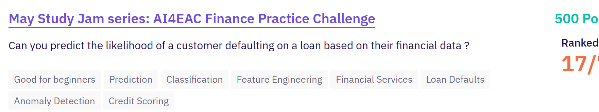

# Prédiction du défaut de remboursement, Kenya et Ghana

Projet réalisé pour l’AI4EAC Finance Practice Challenge sur Zindi. L’objectif est de prédire si un prêt sera remboursé ou passera en défaut.

Le `train set` contient uniquement des prêts kenyans. Le `test set` mélange des prêts kenyans et ghanéens. Le problème central est donc un `domain shift` : le modèle apprend les relations observées au Kenya, puis doit les appliquer à un pays dont les profils de prêt et les conditions économiques diffèrent.



| Indicateur | Résultat |
|---|---:|
| Public F1 | 0,6805 |
| Meilleur OOF F1 | 0,8968 |
| Classement | 17e sur 151 |
| Progression du Public F1 | 0,6318 à 0,6805 |

[Démo Gradio](https://huggingface.co/spaces/kgueye001/africa-credit-scoring)
[Documentation de l’API](https://africa-credit-api-245513771842.europe-west1.run.app/docs)

## Données

```text
Train.csv : 68 654 lignes, Kenya uniquement, 1,83 % de défauts
Test.csv  : 18 594 lignes, Kenya à 81 % et Ghana à 19 %
```

Les données ont une structure hiérarchique. Un client peut avoir plusieurs prêts, et un même prêt peut apparaître sur plusieurs lignes lorsqu’il implique plusieurs prêteurs. Les lignes d’un même prêt portent la même target.

```text
Client
  -> plusieurs prêts
      -> plusieurs lignes, une par prêteur
```

La structure hiérarchique des données a motivé un `multi-granularity stacking`. Un premier modèle produit des prédictions au niveau `line-level`, afin de conserver les informations propres à chaque prêteur. Un second modèle travaille au niveau `loan-level`, avec des variables agrégées sur l’ensemble du prêt. Les deux prédictions sont ensuite combinées dans la prédiction finale.

## Feature engineering

Le jeu initial contient 16 colonnes. Le `feature engineering` a produit plus de 53 variables.

Les ratios financiers sont plus informatifs que les montants bruts. J’ai calculé le coût relatif du crédit, le ratio de remboursement, l’intérêt journalier et la part de financement de chaque prêteur.

```python
interest_pct = interest_amount / total_amount
repay_ratio = total_to_repay / total_amount
daily_interest = interest_amount / duration
lender_vs_total = amount_funded / total_amount
```

Les variables de date ont été converties en mois, jour de semaine, trimestre et indicateur de week-end. La durée effective du prêt est calculée à partir des dates de décaissement et d’échéance.

Des agrégations par client, prêteur et prêt ont ensuite été ajoutées. Elles sont calculées sur le `train set`, puis appliquées au `test set`. Les nouveaux clients ghanéens reçoivent une valeur de repli basée sur la médiane du train kenyan.


## Modélisation

Le modèle principal est LightGBM. Il gère bien les relations non linéaires et les variables de nature différente. Le paramètre `is_unbalance=True` a été retenu pour tenir compte du ratio de défaut très faible.

La validation repose sur une `StratifiedKFold cross-validation` à cinq folds. Les `OOF predictions` servent à mesurer les performances locales et à effectuer le `threshold tuning`.

Le seuil final est fixé à 0,715. Le seuil par défaut de 0,5 produisait trop peu de prédictions positives pour une classe représentant seulement 1,83 % des observations.

## Multi-granularity stacking

Deux modèles ont été entraînés :

```text
Line-level model
  -> conserve les signaux associés à chaque prêteur

Loan-level model
  -> agrège les informations de tous les prêteurs du prêt

Final prediction
  -> moyenne 50 % line-level, 50 % loan-level
```

Le `line-level model` capte les différences entre prêteurs. Le `loan-level model` résume la structure complète du financement. J’ai gardé une moyenne simple entre les deux. Un `ensemble` plus large était plus difficile à interpréter et n’apportait pas de gain stable sur le Public F1.

Le `multi-granularity stacking` a fait passer le score de 0,6648 à 0,6805.


## Expérimentations

| Version | Changement principal | Public F1 |
|---|---|---:|
| V1 | LightGBM baseline | 0,6318 |
| V2 | Correction des agrégations | 0,6430 |
| V3 | Target encoding | 0,2710 |
| V4 | Comparaison de modèles et ensembles | 0,6628 |
| V5 | Pseudo-labeling | 0,6149 |
| V8 | Variables macroéconomiques 2024 | 0,6648 |
| V16 | Multi-granularity stacking | 0,6805 |

Le `target encoding` a créé du `data leakage`. Le score local semblait correct, mais le Public F1 est tombé à 0,2710. Les statistiques utilisées pour les features doivent être calculées uniquement sur les données d’entraînement.

Le `pseudo-labeling` n’a pas fonctionné. Les prédictions sur le Ghana étaient trop bruitées pour être réutilisées comme labels. Plusieurs essais de `hyperparameter tuning` ont aussi amélioré l’OOF F1 au Kenya tout en réduisant le score public. Un meilleur score local ne garantissait pas une meilleure robustesse face au `domain shift`.

## Déploiement

Le modèle est servi avec FastAPI. L’API charge les cinq modèles LightGBM issus de la cross-validation et retourne une probabilité de défaut, une décision binaire, un `credit score` et une catégorie de risque.

```text
Kaggle notebook
  -> LightGBM models
  -> FastAPI
  -> Docker
  -> Google Cloud Run
  -> Gradio sur Hugging Face Spaces
```

Les principaux endpoints sont les suivants :

```text
GET  /health
GET  /model/info
POST /predict
```

Exemple de requête :

```json
{
  "Total_Amount": 50000,
  "Total_Amount_to_Repay": 55000,
  "duration": 30,
  "country_id": "Kenya",
  "loan_type": "Type_1"
}
```

## Structure du dépôt

```text
notebooks/
  eda.ipynb
  v8_best_single.ipynb
  v16_stacking.ipynb

api/
  model.py
  app.py
  Dockerfile
  requirements.txt

demo/
  gradio_app.py

images/
  challenge_banner.png
  eda_insights.png
  model_comparison.png
```

## Lancer l’API en local

```bash
git clone https://github.com/gueye001/Africa-Credit-Scoring-Challenge
cd Africa-Credit-Scoring-Challenge/api

pip install -r requirements.txt
python app.py
```

La documentation interactive est accessible sur `http://localhost:8080/docs`.
